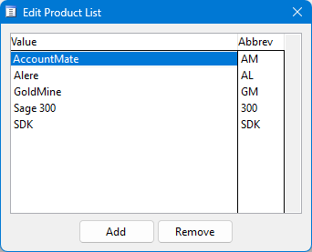
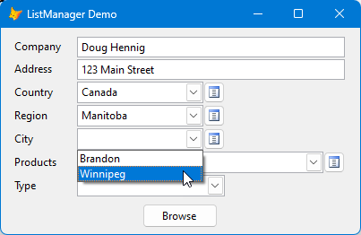
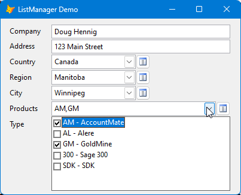

# List Manager

Project manager: Doug Hennig

Many tables have columns containing a small range of values. For example, for a customer type column in a customer table, the acceptable values might be "Business", "Consumer", and "Government". Your choices for data entry into such columns are:

* Allow the user to type a value. This is bad idea because the user may not know what the acceptable values are or may type them incorrectly.

* Hard-code the values in a combobox. Adding values to the list means changing the program and deploying an update.

* Create lookup tables for the values. If there are a lot of such columns, that's a lot of tables and maintenance forms for those tables to create.

List Manager takes care of these issues. A single table contains all of the lookup values for an application and a single maintenance form allows users to add, edit, or remove values.

Users can select a single value from a specific type of lookup:

or select multiple values into a comma-separated string:

## Documentation

See the [documentation](docs/documentation.md) for details on using List Manager.

## Releases

Latest release: 2024-08-24, version 1.0.09002

See the [change log](ChangeLog.md) for release information.

## Helping with this project

See [How to contribute to List Manager](.github/CONTRIBUTING.md) for details on how to help with this project.

----

