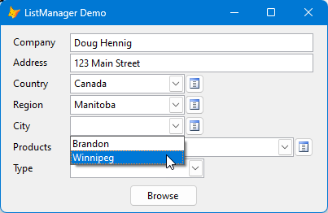

# List Manager Documentation

List Manager allows users to select pre-determined values from a drop-down list. This avoids misspellings or other bad values in your database. For example, for a customer type column in a customer table, the acceptable values might be "Business", "Consumer", and "Government". Rather than having the user type a value, or hard-coding the values in a combobox, or creating a small lookup table just for these values, use List Manager.

## List Table

List Manager uses a list table to contain the values the user can choose from. The list table can contain multiple lists of different types. For example, the image below has five different types of lists: country (Type = 1, the Canada and US records), region (Type = 2, the Manitoba, Saskatchewan, North Dakota, and California records), city (Type = 3), product (Type = 4), and customer type (Type = 5). One type can be a subtype of another. For example, notice that the Manitoba and Saskatchewan records have ParentID set to 1, meaning they belong to Canada. Winnipeg and Brandon have ParentID set to 3, meaning they belong to Manitoba.


The list table has this structure as a minimum (other columns are ignored):

* ID: the primary key. It must be Integer (auto-inc) and have a tag named ID.

* Type: the type of list. It can be Integer or Character (any length), since you specify the list type for each list control (the ListType property).

* Value: the value for this item in the list. It must be Character but can be any length you wish.

* Abbrev: an abbreviation for the value. It must be Character but can be any length (although shorter is better).

* ParentID: the ID of the parent item for this item. For example, if you have a list of countries (Type is, say, "Country") and a list of regions in each country (Type is, for example, "Region"), the ParentID for each region would be the ID of the country the region belongs to. It must be Integer.

You can create and populate your own list table if you wish or let ListManager create it for you. The default is List.dbf in the current directory; if that table doesn't exist, it's created automatically the first time it's used. However, you can specify your own table name and path; see the ListManager Class section below.

## List Controls

There are two controls in ListManager.vcx: ListManagerComboBox and ListManagerComboTree.

### ListManagerComboBox

Use this control for single value selection. Drop it on a form or container and set the properties as necessary (see below). Size it as desired, then right-click and choose Builder to size and position the controls within the control properly (this also happens at runtime so using the builder isn't strictly required).

ListManagerComboBox has the following properties:

| Name            | Description|
|-----------------|------------|
| AllowBlank      | .T. to include a blank item in the list, .F. to not do that (the default). Set this to .T. to allow the user to select a value from the list or a blank, or .F. to force the user to select one of the values.|
| AllowEdit       | .T. to show the Edit button (the default), .F. to hide it. Clicking this button displays a dialog (the ListManagerEditForm class) in which the user can add, edit, and remove list items.|
| AllowTyping     | .T. to allow the user to type a non-list value, .F. to only allow selection from the list (the default). This is ignored if BoundToID is .T. since a value typed by the user doesn't have an ID and isn't added to the list.|
| BoundToID       | .T. to bind the control to the ID of the list item (the default), .F. to bind to the value. For example, if a list item has an ID of 25 and a Value of "Business", setting BoundToID to .T. would store 25 to the control source, while setting it to .F. would store "Business".|
| ControlSource   | Set this to the data source as you would with any control. If you leave this blank, you'll have to assign a value to Value, usually in Refresh, and write the value somewhere, usually in AnyChange.|
| FontName        | The font name (default = Segoe UI).|
| FontSize        | The font size (default = 9).|
| ID              | The ID of the selected item.|
| ListType        | Set this to the Type of list this control is for. For example, if the records in the list table for countries all have Type set to "Country", set Type for the control to "Country".|
| ParentID        | Set this to the ParentID for the items to display. This is often done in the AnyChange method of a related control. For example, suppose the list table contains countries and regions in each country. The ParentID column for the region records would contain the ID for the country the region belongs to. In the AnyChange method of a control to select country, set the ParentID of the control to select region to the selected ID, using code such as `Thisform.cboRegion.ParentID = This.ID`.|
| TypeDescription | The description for the type. This is used in the caption of the edit dialog. For example, for a control to select country, set TypeDescription to "Country".|
| Value           | The selected value.|

### ListManagerComboTree

Use this control for multi-value selection. Drop it on a form or container and set the properties as necessary (see below). Size it as desired, then right-click and choose Builder to size and position the controls within the control properly (this also happens at runtime so using the builder isn't strictly required).

ListManagerComboTree has the following properties:

| Name            | Description|
|-----------------|------------|
| AllowEdit       | .T. to show the Edit button, .F. to hide it. Clicking this button displays a dialog (the ListManagerEditForm class) in which the user can add, edit, and remove list items.|
| ControlSource   | Set this to the data source as you would with any control. If you leave this blank, you'll have to assign a value to Value, usually in Refresh, and write the value somewhere, usually in AnyChange.|
| FontName        | The font name (default = Segoe UI).|
| FontSize        | The font size (default = 9).|
| ListType        | Set this to the Type of list this control is for. For example, if the records in the list table for countries all have Type set to "Country", set Type for the control to "Country".|
| TypeDescription | The description for the type. This is used in the caption of the edit dialog. For example, for a control to select country, set TypeDescription to "Country".|
| UseAbbreviation | .T. to concatenate the abbreviations of the selected items for Value, .F. to concatenate the values of the selected items (the default). Since concatenated values can get quite long, abbreviations may be more useful.|
| Value           | The value of the control.|

Note that unlike ListManagerComboBox, ListManagerComboTree doesn't have AllowBlank, AllowTyping, BoundToID, ID, or ParentID properties. AllowBlank isn't needed because the user can uncheck all of the items in the list. AllowTyping isn't needed because it doesn't make sense to allow the user to type non-list items in this case. The others aren't needed because the individual IDs aren't used but instead the value of the control is a comma-limited list of the selected values (for example, "Argentina,Brazil,Columbia").

## ListManager Class

The ListManager class is automatically instantiated by the list controls into a property of _VFP named oListManager. It assumes the list table is named List.dbf and it's in the VFP path. If you want to use a subclass of ListManager or specify a different table name or path, instantiate the desired class yourself and set the cTable property to the name and path of the list table. For example:

```
addproperty(_vfp, 'oListManager', newobject('ListManager', 'ListManager.vcx'))
_vfp.oListManager.cTable = 'C:\MyFolder\MyListTable.dbf'
```

ListManager has one method, GetValuesForType. This method accepts these parameters:

* tuItems: the array to store the values into (passed by reference using @) or the name of a cursor to create.

* tuListType: the list type to get values for.

* tnParentID: the parent ID to get values for (optional: if it isn't specified, parent is ignored).

* tlIncludeBlank: .T. to include a blank item in the array or cursor.

* tnDataSession: the data session ID to create the cursor in (optional).

This method creates the specified cursor or fills the specified array with four columns from the list table: Value, ID, ParentID, and Abbrev. It returns the number of items in the array or cursor.

## Editing List Values

If AllowEdit for a control is .T., the Edit button appears to the right of the combobox. Click the button to display the edit dialog (the ListManagerEditForm class).


The user can edit a value in the grid, add a value by clicking Add, or remove the selected value by clicking Remove.

### Localization
The dialog is localizable: it either uses a global object named oLocalizer if it exists or instantiates SFLocalize in SFLocalize.vcx if that VCX can be found. The captions of the form, the Add and Remove buttons, and the grid column headers are localized.

> The values in the lists are not localized, but could be in a subclass of ListManager by overriding the GetValuesForType method.

SFLocalize uses Resource.dbf, a table containing strings in various languages. Only English values are filled in, so fill in the content of the desired language column with the translation for the English value. If you want to use a language that isn't already in the table, add a column for that language and fill in the values.

Set the cLanguage property of the ListManager object to the desired language if it's not English. For example:

```
_vfp.oListManager.cLanguage = 'French'
```

> The [ErrorHandler](https://github.com/DougHennig/ErrorHandler) project also uses SFLocalize.vcx and Resource.dbf, so if you use ErrorHandler and want to localize both projects, USE Resource from one of them and APPEND FROM the other one to combine the records into one table.

## Demo

Demo.scx in the Demo folder shows an example of using ListManager. The columns of a customer cursor are bound to the controls in the form. Country, Region, and Type use ListManagerComboBox and Products uses ListManagerComboTree. Selecting a country limits  Region to regions for that country, and selecting a region limits City to cities in that region, except you can type a city if you wish (AllowTyping is set to .T. for that control).



You can check multiple products when the Products list is dropped down. It displays abbreviations because UseAbbreviation is .T.


Country, Region, City, and Products are character fields in the cursor so the value selected is stored in the cursor (BoundToID is set to .F. for those controls). Type is numeric so the ID of selected type is stored (BoundToID is set to .T.). Click the Browse button to see the cursor.

## Deploying ListManager

To include ListManager in your application, add the following to your project:

* ListManager.vcx

* SFComboTree.vcx

* SFCtrls.vcx

* EditListTable.bmp

* EditListTable.ico

* SFLocalize.vcx (only if you want ListManagerEditForm to be localized)

* Resource.dbf, cdx, and fpt (only if you want ListManagerEditForm to be localized).

If you create and populate the list table, you'll need to deploy the DBF and CDX with your application.
